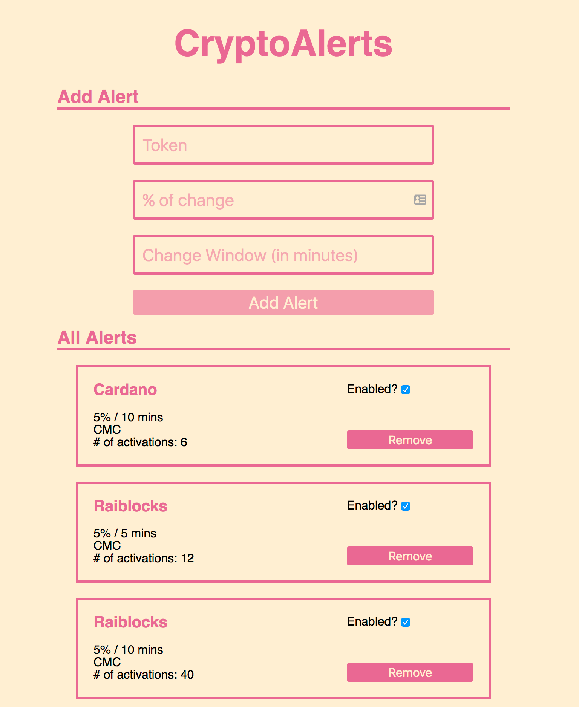

# CryptoAlerts
CryptoAlerts is a service for tracking price percentage changes of cryptocurrencies and triggers a text message alert when the user entered threshold is hit.

I wrote this for a friend who does some cryptocurrency day trading and wanted a way to watch for significant price changes. The frontend is a very simple React app that talks to a Node.js backend being run on AWS Lambda. A PostgresSQL database is used to keep track of cryptocurrencies being watched as well as recent prices for those currencies.

When adding a cryptocurrency to track, the user enters the token name, the percentage of change to watch for, and the time window of the change. So, for example, a user might want to watch Bitcoin for a 3% change over 1 hour. If the currency being tracked is Bitcoin, Litecoin, or Ethereum, the GDAX public price API is used to pull current prices. For other currencies, coinmarketcap's API data is used.

In order to detect price changes over windows, an AWS Lambda scheduled job activates every 5 minutes and records the current price for all cryptocurrencies being watched. The latest reading is compared to the last reading in the time window for the alert to see if a text message needs to be fired. The logic for comparing current prices to last prices in a window for all alerts is handled completely in a PostgresSQL view function that pulls all alerts that need to be fired in a single query. If a text message needs to be dispatched, the AWS Lambda job uses the Twilio API to send the SMS.

