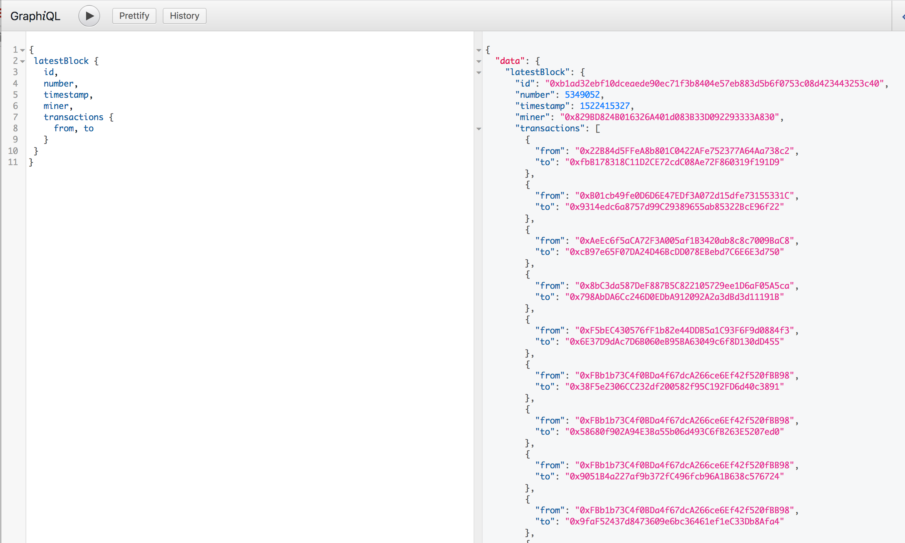

# eth-ql
eth-ql is a simple set of bindings to allow GraphQL lookup and exploration on the Ethereum blockchain.

This was mainly a project to familiarize myself with GraphQL and how to write a GraphQL API. By using a provided node from [Infura](https://infura.io/), I used Ethereum's web3.js to implement types and queries to pull data from the Ethereum mainnet.

At the moment, queries are limited to pulling information for blocks, transactions, addresses, and ERC20 tokens.

The code is open source and available here: [https://github.com/poffdeluxe/eth-ql](https://github.com/poffdeluxe/eth-ql)

To try it out, a demo is available using Graphiql here: https://eth-ql.herokuapp.com/graphiql
or if you want to try it out with a sample query: https://eth-ql.herokuapp.com/graphiql?query=%7B%0A%20latestBlock%20%7B%0A%20%20%20id%2C%0A%20%20%20number%2C%0A%20%20%20timestamp%2C%0A%20%20%20miner%2C%0A%20%20%20transactions%20%7B%0A%20%20%20%20%20from%2C%20to%0A%20%20%20%7D%0A%20%7D%0A%7D

