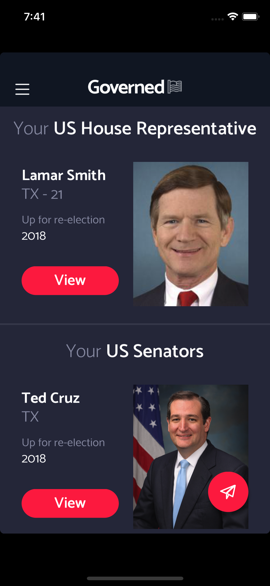

# Governed
Governed is a mobile app to foster civil engagement and connection with a voter's representatives. The Governed website is located [here](http://www.governed.io/). Governed is still published and available on both Google Play as well as the iOS App Store.

When a user opens the app for the first time, they are prompted to enter their address. Using that address, the user's congressional representatives are calculated. From the home screen, users can view information regarding their reps or choose to get in contact with them. In the contact flow, the user can call, fax, or dispatch a snail mail letter to their rep. If the fax or snail mail option is selected, a short letter can be typed and then previewed before sending.

This app was my first foray into using React Native for mobile applications. It was also my first time to use Firebase as a datastore and backend. Calculating reps and sending messages over fax/mail are both triggered using Firebase's integration with Google Cloud Functions. Twilio's fax API handles the actual sending of the faxes.

