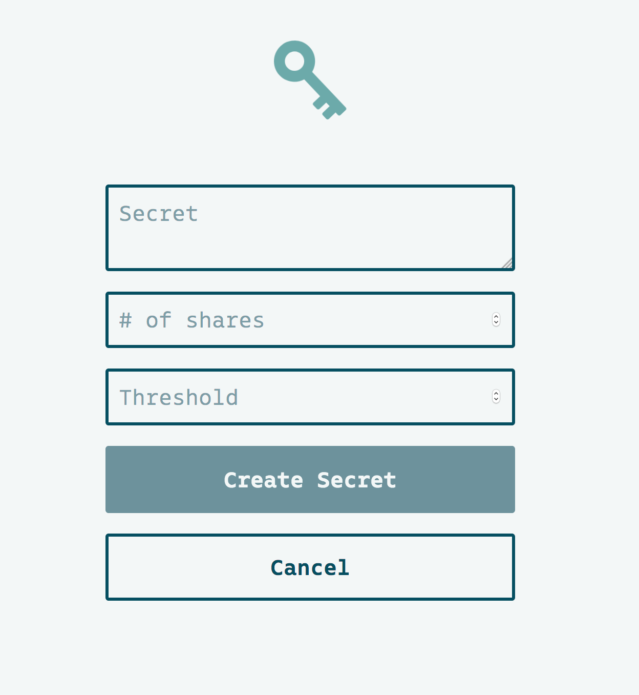
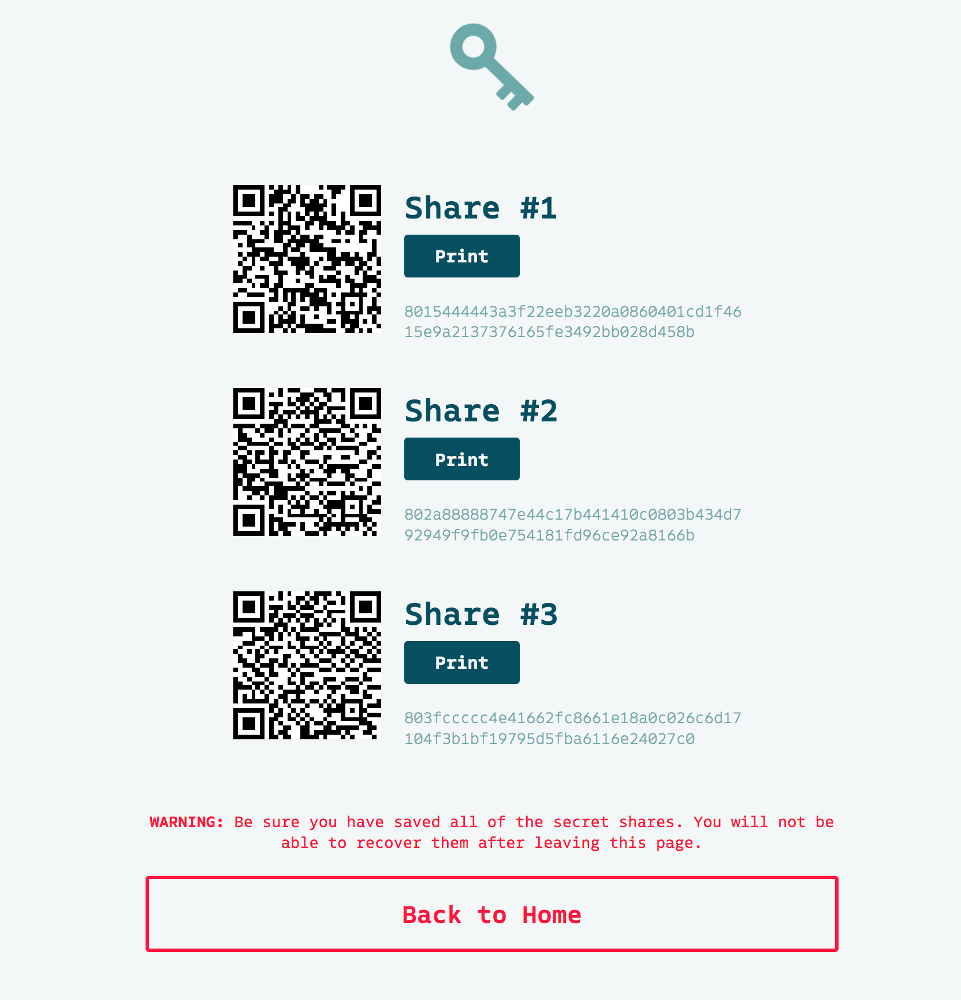
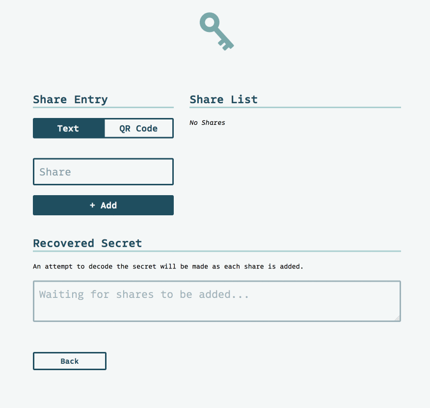

# Key Dance
Key Dance is a user-friendly way to encrypt a secret and share it with others using [Shamir's Secret Sharing](https://en.wikipedia.org/wiki/Shamir%27s_Secret_Sharing) algorithm.

This webapp is a work-in-progress collaboration with a friend who wanted a way to keep Ethereum private keys safe but accesible in the case of end-of-life planning. While Shamir's Secret Sharing is not a super new algorithm, there aren't many websites that have easy-to-use encoding and decoding functions.

When creating a secret to share, the user enters the secret text (like a Bitcoin or Ethereum private key, for example), the number of shares to break the secret into, and the number of shares required to unlock the secret. After the user submits the form, the key for each share is displayed as well as a QR code corresponding to each share. Each QR code can be printed out and distributed.

When a secret is ready to be recovered, a user can enter the share keys via text input or by using their webcam to scan the QR codes. Each time a secret is added, an attempt to decrypt the original message is made.

In order to keep the user's information safe and secure, there is no backend for this app. The React app handles everything from generating the secret shares to decoding the secret shares or reading QR codes from the webcam.

While an open source release is planned soon, a demo can be found here: [https://poffdeluxe.github.io/key-dance/](https://poffdeluxe.github.io/key-dance/)

